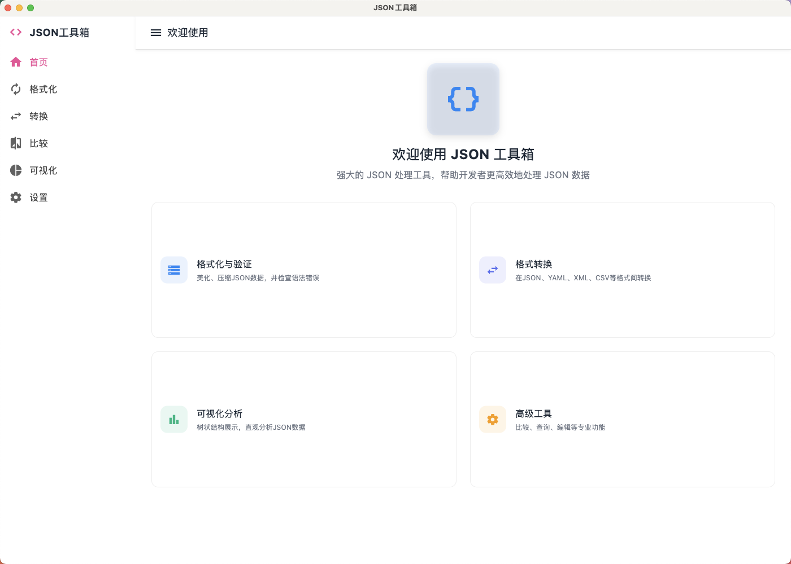
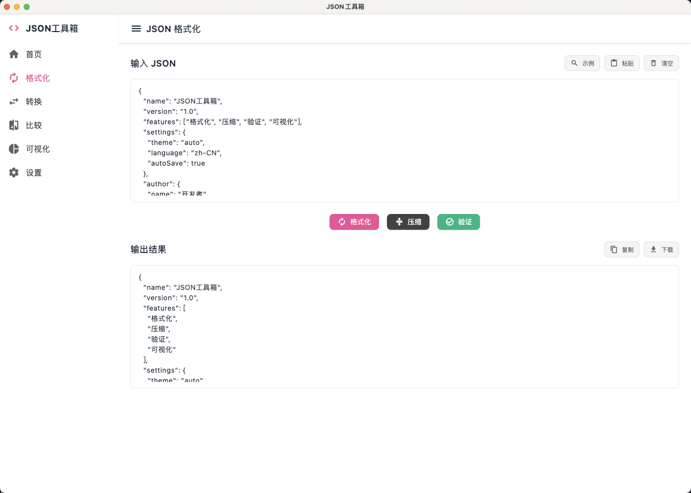
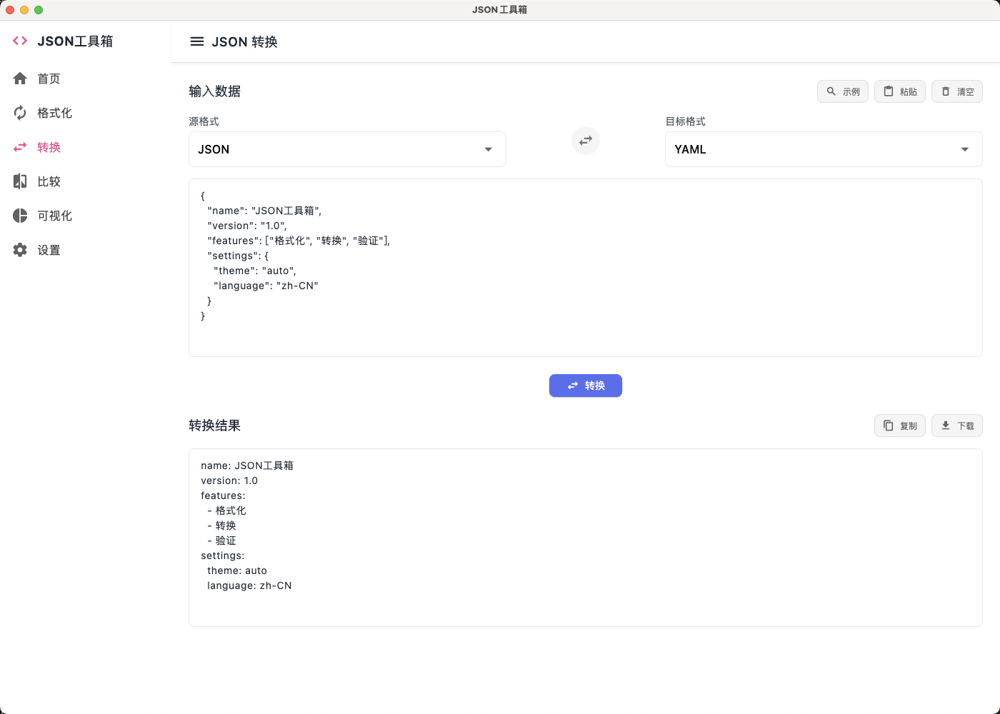
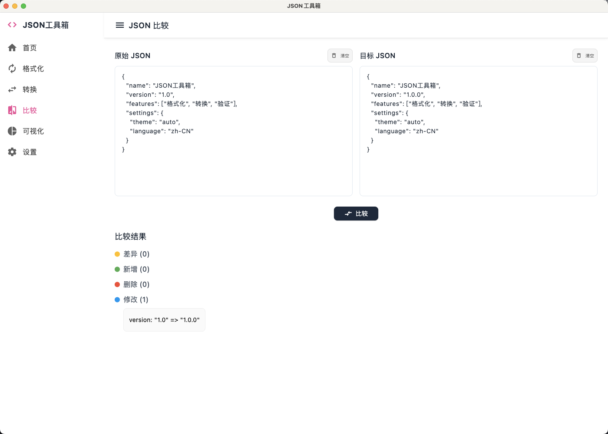
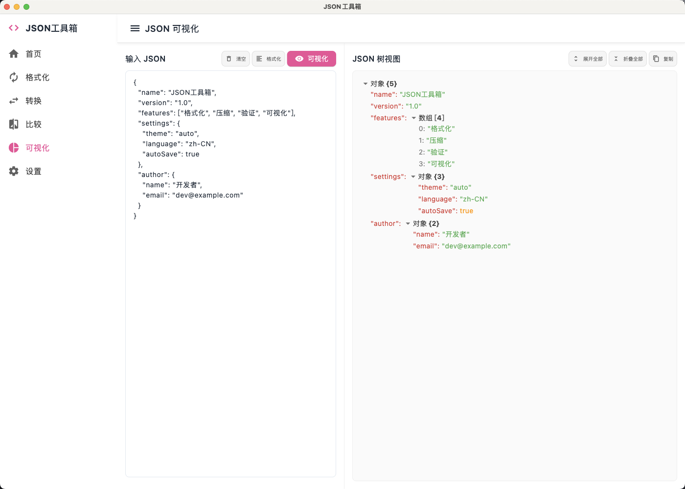
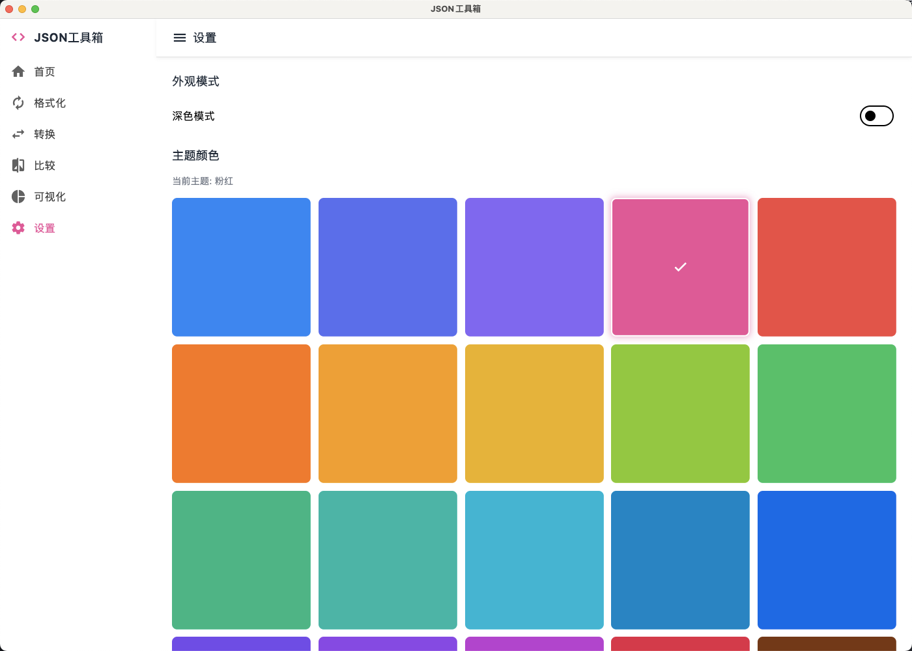

# JSON Tools

一款功能强大的 JSON 处理工具，基于 Flutter 开发，支持多平台运行。

## 功能特点

- **JSON 格式化**：美化 JSON 数据，使其更易读
- **JSON 压缩**：移除空格和换行符，减小 JSON 体积
- **JSON 验证**：检查 JSON 格式是否有效
- **JSON 可视化**：树状结构展示 JSON 数据，支持折叠/展开
- **JSON 比较**：对比两个 JSON 文件的差异
- **格式转换**：
  - JSON ↔ YAML
  - JSON ↔ XML
  - JSON ↔ CSV
  - JSON ↔ URL 参数

## 项目截图

### 主界面


### JSON 格式化


### 格式转换


### JSON 比较


### JSON 可视化


### 设置



## 使用说明

1. 在左侧输入或粘贴 JSON 数据
2. 选择需要执行的操作
3. 查看右侧处理结果

## 开发环境

- Flutter 3.0+
- Dart 2.17+

## 项目结构

```bash
lib/
├── main.dart              # 应用入口
├── screens/               # 页面
│   ├── home_screen.dart   # 主页
│   ├── format_screen.dart # 格式化页面
│   ├── compare_screen.dart # 比较页面
│   ├── convert_screen.dart # 转换页面
│   └── visualize_screen.dart # 可视化页面
├── widgets/               # 组件
├── utils/                 # 工具类
│   └── json_utils.dart    # JSON 处理工具
├── theme/                 # 主题
└── providers/             # 状态管理
```


## 安装方法

1. 克隆仓库
```bash
git clone https://github.com/yourusername/json_tools.git
cd json_tools
```
2. 安装依赖
```bash
flutter pub get
```
3. 运行应用
```bash
flutter run
```

## 贡献指南
欢迎提交 Pull Request 或创建 Issue 来帮助改进这个项目。

## 许可证
MIT License